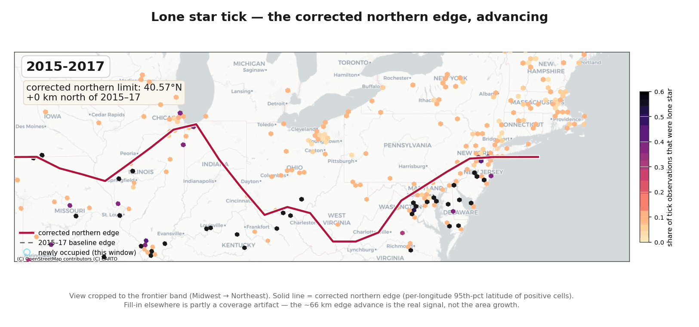
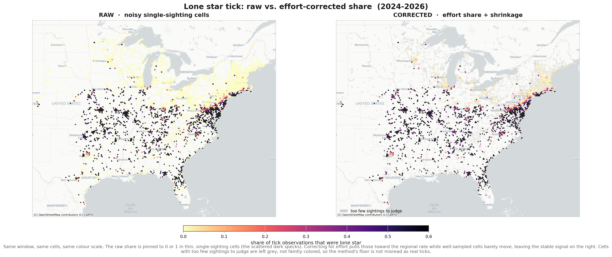

# Lone Star Tick: the Effort-Corrected Frontier

The lone star tick used to be a Southern creature. Over the last few decades it
has been creeping northward, and it now turns up in New York and New England,
places it was basically never seen before. That matters because its bite can do
strange things, most famously triggering a sudden allergy to red meat. So a fair
question for anyone living in the Northeast is: is this thing coming to my area,
and how fast?

### [Open the live interactive map](https://ahedy7.github.io/lone-star-tick-spread/)

This project answers that with a map you can scrub through time. You drag a slider
from the past toward today and watch the tick's leading edge climb north across
the country, year by year: where the front line sat about a decade ago, where it
is now, and how quickly it has been advancing. Instead of a frozen snapshot, you
see the movement. And it delivers one honest headline number: the leading edge of
the tick's range has pushed north by about 66 km (41 miles) over the decade.

Now the part that makes it more than a pretty picture. The map is built from
sightings that ordinary people report. Someone finds a tick, photographs it, logs
it in a nature app. The catch is that those apps have exploded in popularity. So
if you simply count sightings, you will see a huge increase that has nothing to do
with ticks. It is just more people walking around with phones, looking and
reporting. It is the same trap as a town that installs a pile of new security
cameras and then panics that crime is rising, when really it is only watching
more.

So the project does something careful. Instead of asking how many ticks were
reported in a place, it asks what share of all the nature-spotting there was
ticks. If a place lights up for ticks specifically, not just for nature reports in
general, that is a real signal. That single move separates "the ticks are actually
spreading" from "more people are just looking," and it is the difference between a
credible project and a misleading one.

Then, to make sure it is not fooling itself, it checks its answer against the
official record. The CDC publishes which counties it considers to have established
tick populations, so the project lays its own picture next to the government's
verified one. Where they agree, you can trust it. Where the project shows ticks
before the CDC has caught up, that is the interesting edge, a possible early
warning of where they are headed next.

Last piece: the map keeps itself current. Rather than being frozen on the day it
was made, it refreshes on its own, so a few months from now it shows newer
sightings than it does today, with a last-updated date on it. Someone checking in
next spring sees next spring's leading edge, not last year's.

<p align="center">
  
</p>
<p align="center"><em>The corrected northern edge, cropped to the Midwest-to-Northeast
frontier band so the advance is legible. The climbing crimson line is the
per-longitude 95th-percentile latitude of positive cells; the dashed line is the
2015-2017 baseline.</em></p>

---

## The headline

| Result | Value |
| --- | --- |
| Corrected northern-limit advance (decade) | **about 66 km (41 miles)** |
| CDC validation precision, strict | **77.6%** |
| CDC validation precision, lenient (incl. CDC-reported) | **93.7%** |
| CDC validation recall of established counties | **44.6%** |

**What the numbers mean.** The northern edge of the tick's range has moved about
66 km (41 miles) north over the past decade. We measure that edge in a way that
ignores the occasional stray tick found far from the range, so one unusual
sighting cannot distort it. To check the map, we compare it against the CDC's
official county records. When our map flags a county as having the tick, the CDC
agrees about 78 percent of the time, rising to 94 percent if we also count
counties the CDC has at least received reports from. Looking the other way, our
map catches about 45 percent of the counties the CDC officially recognizes. The
ones we miss are mostly rural counties with few people reporting, so that gap
reflects where people are looking, not where the tick is.

---

## How the map works

Presence-only citizen-science data conflates two different things: where the
ticks are, and where people are looking for ticks. iNaturalist sightings cluster
around cities and trailheads, so a raw map of lone star sightings is partly a map
of human observers. Read naively, that bias invents range expansion out of
nothing but growing app adoption.

The core move here cancels that bias. For each H3 cell and each rolling 3-year
window we compute a ratio:

```
share = (iNaturalist lone star observations) / (iNaturalist all-hard-tick observations)
```

Numerator and denominator come from the same opportunistic process in the same
place at the same time, so platform growth and observer density divide out. What
remains is the share of tick-spotting effort that was lone star, which is a
property of the ticks, not of the observers. Thin cells with a single sighting
would still read as a noisy 0 or 100%, so a beta-binomial empirical-Bayes
shrinkage pulls those toward the regional rate while leaving well-sampled cells
alone.

Two independent layers keep the citizen-science story honest:

- **NEON** is a structured drag-cloth survey. It is collapsed to simple presence
  per cell and never enters any ratio (its multiplicity is sampling intensity,
  not abundance). It is an independent anchor for "the tick is really here."
- **CDC** county establishment is a separate, official footprint. Stage 5 uses it
  as a spatial checkpoint: do the counties we flag line up with the counties CDC
  has established?

<p align="center">
  
</p>
<p align="center"><em>Same window, same cells, same color scale. Raw share (left) is
pinned to 0 or 1 in thin single-observation cells (the scattered dark specks);
shrinkage (right) pulls those toward the regional rate while well-sampled cells
barely move, leaving the stable effort-corrected signal.</em></p>

### Why some empty areas show a faint value (and how the map handles it)

Cells with very little data lean on the national average. Because the shrinkage
formula has a floor it can never reach exactly zero, a handful of cells well
outside the tick's true range (California, for instance, where lone star ticks are
essentially absent) can show a faint nonzero value. That faint value is an
artifact of the method, driven by how few sightings the cell has, not by real
ticks. The map handles this by not coloring cells that have too few sightings to
judge: a cell with no lone star sightings and only a handful of tick sightings is
left a neutral grey instead of a faint color. The deeper fix, letting each cell
borrow from its neighbors instead of from the national average, is the natural
next step and is left as documented future work.

---

## Honest caveats, up front

These are stated plainly because the value of the project is the method and the
craft, not a dramatic discovery.

- **This is a decade story.** About 94% of the records are post-2015, so the
  analysis covers roughly 2015 to present, not a century of spread.
- **Occupied-cell growth is partly a coverage artifact.** More observers map more
  places, so raw area growth overstates range expansion. The honest signal is the
  contrast between the raw and corrected surfaces and the slow northward push of
  the leading edge, not the total area lit up.
- **CDC validates the where, not the when.** CDC "established" is a single
  cumulative, sticky snapshot, so the checkpoint is a spatial overlap, not a
  test of timing.
- **Recall blind spots are coverage, not absence.** The 44.6% recall misses rural,
  low-observer counties. Those are gaps in who is looking, not evidence the tick
  is absent.
- **The advance is modest.** About 66 km over the decade is real but small. The
  point is a defensible bias-correction pipeline, not a headline migration.

---

## How the auto-update is scoped

Read this so the "self-updating" claim is not oversold.

- **Refreshes monthly:** the GBIF / iNaturalist citizen-science frontier. A
  scheduled GitHub Action re-pulls GBIF, re-runs clean -> stage3 -> stage4, stamps
  a new data vintage, and redeploys the map.
- **Annual, manual vintage:** the CDC establishment layer. It updates rarely and
  by hand and is currently the CDC 2025 vintage. It is a periodic checkpoint, not
  a live layer.
- **Its own cadence:** NEON. The structured survey is not on the monthly cron.

A data-freshness guard runs before every deploy. If a GBIF pull is empty, drops
by more than 20% against the last known-good run, or fails basic sanity checks
(numerator never exceeds denominator, all proportions in [0, 1]), the workflow
fails loudly and the previous map stays live. A GBIF outage cannot overwrite a
working public map with an empty one.

---

## Data provenance

- **GBIF occurrences** (US, georeferenced), pulled via the citable download API.
  iNaturalist research-grade observations flow into GBIF, so one pull captures
  both museum specimens and citizen-science sightings.
  - *Amblyomma americanum*: [https://doi.org/10.15468/dl.p85b8y](https://doi.org/10.15468/dl.p85b8y)
  - Family Ixodidae (effort denominator): [https://doi.org/10.15468/dl.9ch43z](https://doi.org/10.15468/dl.9ch43z)
- **CDC** [Lone Star Tick Surveillance](https://www.cdc.gov/ticks/data-research/facts-stats/lone-star-tick-surveillance.html),
  county-level establishment, 2025 vintage (a cumulative, sticky footprint).
- **NEON** tick datasets reach the pipeline through GBIF (a biorepository
  specimen dataset and a drag-cloth sampling-event dataset), tagged as NEON by
  publishing organization and used only as independent presence.

Each raw pull is stamped with its date and record count and carries a
`*.manifest.json` provenance sidecar (resolved taxonKey, filters, GBIF download
key and DOI, counts).

---

## Reproduce it

```bash
python -m venv .venv
.venv\Scripts\activate          # Windows
source .venv/bin/activate       # macOS / Linux
pip install -r requirements.txt
```

The GBIF download API needs a free GBIF account. Copy the template and fill in
your credentials (the file is gitignored, so secrets are never committed):

```bash
cp .env.example .env            # then edit GBIF_USER / GBIF_PWD / GBIF_EMAIL
```

Run the pipeline in order:

```bash
python src/acquire_gbif.py      # Stage 1: GBIF pull (lone star + Ixodidae effort layer)
python src/acquire_cdc.py       # Stage 1: CDC establishment workbook (annual; not on the monthly cron)
python src/clean.py             # Stage 2: clean, source-tag, reproject (EPSG:5070), H3 res-5 bin
python src/stage3.py            # Stage 3: effort ratio, EB shrinkage, frontier metrics, county detections
python src/stage4.py            # Stage 4: web export + static figures + GIF (use --only web to skip the slow figures)
python src/stage5.py            # Stage 5: CDC validation choropleth + map layers
```

Then open `viz/index.html` in a browser, or serve `viz/` over http. The
interactive map has no Python dependency: it loads deck.gl, MapLibre, and h3-js
from CDNs and reads the exported `viz/data/` bundle. An internet connection is
needed for the map tiles and the CDN libraries.

The monthly GitHub Action (`.github/workflows/refresh.yml`) runs the same
acquire -> clean -> stage3 -> stage4 sequence, gates on the freshness guard
(`src/refresh_guard.py`), and deploys `viz/` to GitHub Pages. To enable it, add
`GBIF_USER`, `GBIF_PWD`, and `GBIF_EMAIL` as repository secrets and set Pages to
the "GitHub Actions" source.

---

## Repository layout

```
lone-star-tick-spread/
├── src/
│   ├── config.py          # every taxon, path, threshold, CRS, and design knob
│   ├── acquire_gbif.py    # Stage 1: taxonKey resolution + GBIF download API (+ search fallback)
│   ├── acquire_cdc.py     # Stage 1: CDC establishment workbook download
│   ├── clean.py           # Stage 2: cleaning, source tagging, reprojection, H3, CDC tidy
│   ├── stage3.py          # Stage 3: windows, NEON presence, effort ratio, EB shrinkage, frontier
│   ├── stage4.py          # Stage 4: web export (+ meta.json vintage) + static figures + GIF
│   ├── stage5.py          # Stage 5: CDC county-level validation
│   └── refresh_guard.py   # Stage 6: data-freshness / sanity gate before any deploy
├── viz/                   # the interactive map (the deployed site root)
│   ├── index.html         # deck.gl H3HexagonLayer over a CARTO Positron basemap
│   ├── app.js · style.css
│   └── data/              # exported payload (bundle.js, cells/neon/frontier JSON, meta.json)
├── notebooks/             # per-stage narrative reports (Stages 1-5)
├── reports/figures/       # committed figures + the frontier GIF
├── .github/workflows/     # deploy.yml (Pages) + refresh.yml (monthly auto-refresh)
└── requirements.txt
```

---

## License

Code is released under the MIT License (see `LICENSE`). Data carries its
sources' terms: GBIF-mediated occurrence records are CC-BY and must be cited via
the DOIs above; CDC surveillance data is US government public domain.
